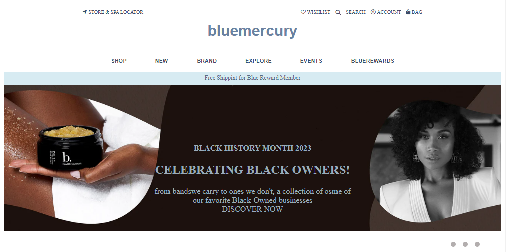
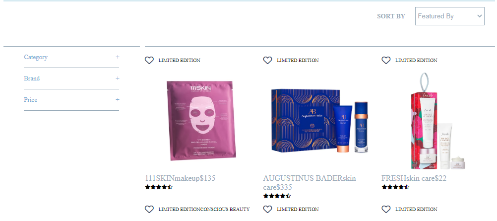
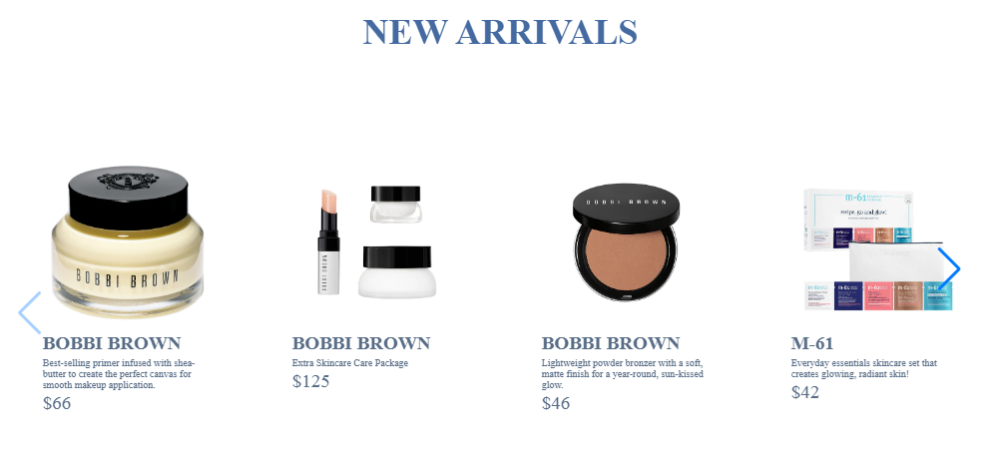

# bluemercury

This is the clone of bluemercury website.Clients can order skin care products or cosmatic products from the website.

## Deployment Link:

https://luminous-cucurucho-42f444.netlify.app/

## Screenshots:

## Contributors:

- Akash
- Divya
- Manoj
- Rajat
- Ghufran

## Tech Stack:

- HTML
- CSS
- JavaScript

## Pages & Features:

Landing Page: Navbars, homepage and footer section.

Sign-In Page: User confirmation to check whether user email and password match with details.

Product Page: Products page where user can select or add to cart for further process.

 Wishlist Page: wishlist features is the ability to save items for later, which would allow users to keep track of products they're interested in without having to purchase them right away.

Cart Page: User can add products to this page or remove products added in the cart.

Checkout Page: Users can add the delivery addresses.

Payment Page: Users can add their payment details and also avail for discount using promo codes.

## Procedure:

To use the website, simply create an account or log in if you already have one, then browse products or services and add them to your cart to make a purchase.

Once you have added all desired items to your cart, proceed to checkout to enter your shipping and payment information, then confirm your order to complete the transaction.